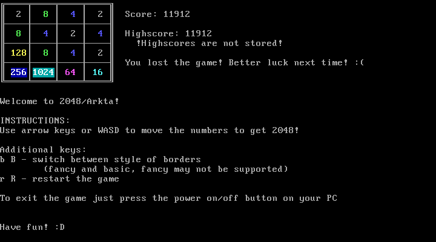
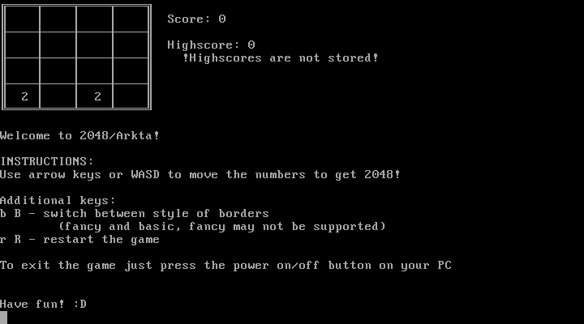
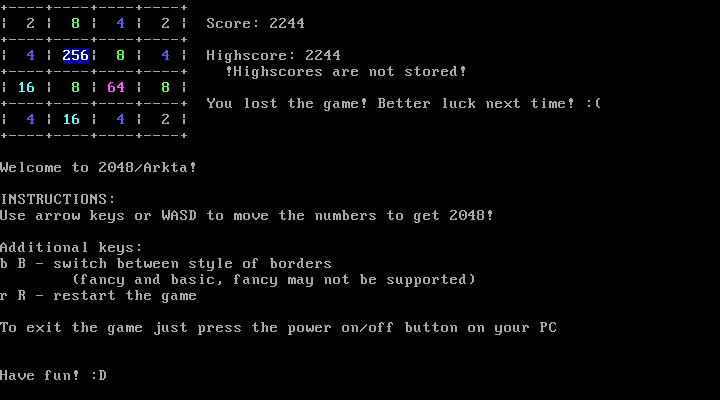

2048/Arkta
==========

This is a 2048 game which doesn't need an operating system to work. It does need a multiboot-compliant bootloader, like GRUB, though.

Screenshots
-----------

Requirements
------------
At least a 32-bit x86 (Intel or AMD, probably others exist, too) computer (64-bit works, too). A keyboard which is attached to the computer with PS/2, but I've heard some computers have built in buggy PS/2 emulation for USB keyboards. 32 MB of RAM in bochs seemed to be enough, but it might work with less. A VGA compliant graphics card. This doesn't mean that you can plug in that blue VGA plug in your computer, this means that your graphics card should not be older than 1990 or so. If you have such a GPU, I am actually surprised you're here and reading this.

You can try to boot 2048 with these virtual machines:
  * bochs (I have added bochsrc.txt and run_bochs.sh so you don't even need to do any setuping)
  * VirtualBox, take note that WASD is pretty much unusable since all letters are repeating themselves for some reason.

Qemu does not work. Well, it works, but keyboard input doesn't. (I really should debug/rewrite my keyboard driver code :P)

Haven't tried on any other virtual machines.

Last time I checked it worked on my laptop's physical hardware, too.

How to get it running
---------------------
1. Compile the code by running `make all` (this does need a normal nasm, custom gcc and binutils, http://wiki.osdev.org/GCC_Cross-Compiler look here for more info) or by getting a compiled kernel from GitHub releases.
2. Now you have a choice:
    * Put the kernel in an .iso file by running update_image.sh script (if I recall correctly, you need grub and xorriso for it to work, probably also some grub-utils). I won't put an iso here just because I will need to find a link to the GRUB source code and link the correct version and I'm too lazy for that :P
    * If you really want to test if it works on your computer with qemu, there's no need to create an .iso. You can just do `qemu-system-i386 -kernel whatever_you_named_the_kernel`, if you have qemu-system-x86_64 or any other compatible architecture it should work, too.
    * If you already are using GRUB as your bootloader, you can add a menu entry that's similar to the one you can find in grub.cfg file pointing to the correct location of the 2048/Arkta kernel. If you do this, don't forget to run `update-grub`.
3. There you go, enjoy this pinnacle of gaming.

How to use it
-------------
You can move the tiles with the arrow keys or WASD or numpad 8/4/2/6. Numlock will not turn numpad keys off. 

You can change the style of the borders by pressing B (or the button where B would be located on a QWERTY keyboard). This is done in case your GPU sets some font which doesn't support the graphical characters of CP437. So, if you see something that does not look like pretty borders, press B to change to borders made with just + - and |.

If you lost the game, or just don't like the current situation, you can restart the game by pressing R. Please note that there is no confirmation if you really want to do it, so think twice before pressing random keys.

There is no key that quits the game just because there is nowhere to quit to. So the only way how to quit the game is to shut down your system. Yes, on real hardware it means pressing that big round button.

Some recommendations
--------------------
Do NOT go over 8192 (is that even possible?). This should technically just display gibberish on the game screen, but it stirs forbidden parts of RAM that best be not disturbed. 

The message *!Highscores are not stored!* is not a bug and doesn't mean that your hardware is faulty. It is just a warning that highscores are not being stored in non-volatile memory, so, if you want to brag about your highscore, take a picture. It's a feature :)

Honestly, Virtualbox is the best place where to play this game due to the fact that you can save machine state when closing so your highscore doesn't get deleted. YAY ^^
